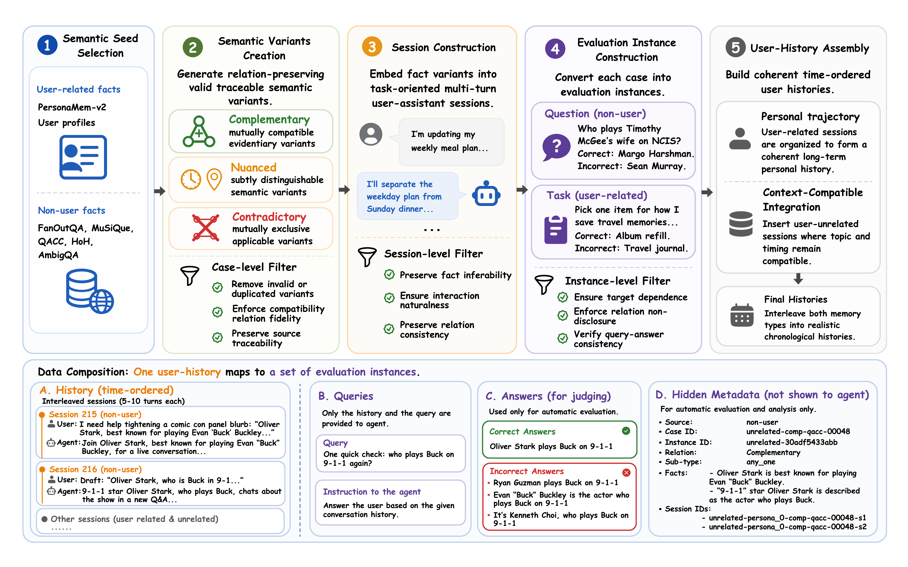

# SubtleMemory: A Benchmark for Fine-Grained Relational Memory Discrimination in Long-Horizon AI Agents

<p align="center">
  <a href="https://arxiv.org/abs/TODO"></a>
  <a href="https://yummytanmo.github.io/SubtleMemory/"></a>
  <a href="https://huggingface.co/papers/TODO"></a>
  <a href="https://github.com/Yummytanmo/SubtleMemory"></a>
</p>

<p align="center">
  <a href="#overview">Overview</a> |
  <a href="#data">Data</a> |
  <a href="#data-construction">Data Construction</a> |
  <a href="#evaluation">Evaluation</a> |
  <a href="#results">Results</a> |
  <a href="#citation">Citation</a>
</p>

## Overview

Long-running assistants accumulate many similar memories about a user, a task,
or an external fact. These memories may complement one another, apply only under
different contexts, or directly conflict. SubtleMemory tests whether memory
systems preserve and use these fine-grained relations instead of only recalling
isolated facts.

SubtleMemory contains 10 persona-level histories, 1,090 relation-controlled
semantic variant sets, and 1,522 evaluation instances. Each instance asks a
downstream question whose answer depends on the relation among target-relevant
memories.

| Relation | What must be preserved |
| --- | --- |
| Complementary | Compatible memories that must be combined, or equivalent memories where any one is sufficient. |
| Nuanced | Time, context, role, scope, or condition boundaries that decide which memory applies. |
| Contradictory | Unresolved conflict that should be surfaced rather than silently collapsed. |

## Framework Features

- **Relation-controlled data construction:** embed latent
  relation-controlled semantic artifacts implicitly into user histories, so the
  target relation is only revealed through later memory-dependent questions.
- **SubtleMemory data:** include the generated benchmark data under
  `data/subtlememory`, with one folder per persona.
- **Unified evaluation:** run standalone memory systems, framework-native
  memory agents, and OpenClaw-style plugin agents under the same
  `add -> finalize -> search -> answer -> evaluate` protocol.
- **Failure diagnosis:** inspect stage artifacts to separate memory writing,
  finalization, retrieval, answer generation, and judging failures.
- **Readback analysis:** compare normal search with readback mode, which uses
  question provenance to expose memory objects written from target sessions.
- **Relation-sensitive reporting:** evaluate relation-level behavior rather
  than only final answer accuracy.

## News

News will be added after the paper and project page are public.

## Repository Layout

| Path | Purpose |
| --- | --- |
| `data/subtlememory/` | Generated bench data, organized as `persona_0` through `persona_9`. |
| `construction/` | Data construction workflows for user-related, user-unrelated, and merged benchmark data. |
| `evaluation/cli.py` | Main entry point for staged benchmark runs. |
| `evaluation/config/datasets/` | Dataset configs, including `subtlememory.yaml`. |
| `evaluation/config/systems/` | Memory-system configs for hosted APIs, native systems, OpenClaw plugins, and baselines. |
| `evaluation/src/adapters/` | Adapter implementations for memory systems and baselines. |
| `evaluation/src/core/stages/` | Stage implementations for add, finalize, search, answer, and evaluate. |
| `assets/` | Paper and README assets, including the data-construction figure. |
| `site/` | Project page source. |

## Install

Use Python 3.10 or newer. From the repository root:

```bash
uv sync
cp env.template .env
```

Edit `.env` with the credentials needed by the systems you want to evaluate or
use for data construction. Common variables include:

- `ANSWER_LLM_API_KEY`, `ANSWER_LLM_BASE_URL`, `ANSWER_LLM_MODEL`
- `JUDGE_LLM_API_KEY`, `JUDGE_LLM_BASE_URL`, `JUDGE_LLM_MODEL`
- `GENERATION_BASE_URL`, `GENERATION_API_KEY`, `FILTER_BASE_URL`, `FILTER_API_KEY`
- Memory-backend credentials such as `MEM0_API_KEY`, `MEMOS_KEY`,
  `EVERMEMOS_API_KEY`, `ZEP_API_KEY`, and local runtime paths for OpenClaw,
  MIRIX, MetaClaw, A-Mem, and MemoBase

## Data

The generated SubtleMemory bench data is stored in this repository at:

```text
data/subtlememory/
  persona_0/
    bench_instances.json
    history_sessions.json
  ...
  persona_9/
    bench_instances.json
    history_sessions.json
```

Each persona bundle contains chronological history sessions and benchmark
instances with relation labels, source facts, target session IDs, correct
answers, and incorrect answers. The evaluation loader converts these bundles to
the LoCoMo-style runtime format used by the staged pipeline.

For evaluation, copy the generated bench data into the evaluation data location:

```bash
mkdir -p evaluation/data/subtlememory
rsync -a data/subtlememory/ evaluation/data/subtlememory/
```

## Data Construction

SubtleMemory is built through a staged construction pipeline that starts from
open-source seed data and ends with persona-scoped benchmark bundles.

[](assets/data_construction.pdf)

High-resolution PDF: [assets/data_construction.pdf](assets/data_construction.pdf)

The construction workflow follows five stages:

1. Select and normalize semantic seed data.
2. Generate relation-controlled semantic variants.
3. Embed variants into implicit, natural multi-turn sessions.
4. Construct evaluation instances and QA targets.
5. Assemble chronological user histories and final bench bundles.

The main construction entry points are:

```bash
uv run python construction/user-related/main.py build
uv run python construction/user-unrelated/main.py generate-to-filter
uv run python construction/user-unrelated/main.py filter
uv run python construction/user-unrelated/main.py build-passed-dataset
uv run python construction/merge_user_related_unrelated.py --help
```

See [construction/README.md](construction/README.md) for the construction
workflow, expected intermediate paths, and links to detailed prompt and data-flow
documents.

## Evaluation

After copying the data into `evaluation/data/subtlememory`, run a small smoke
slice:

```bash
uv run python -m evaluation.cli \
  --dataset subtlememory \
  --system mem0 \
  --run-name mem0-smoke \
  --from-conv 4 \
  --to-conv 5 \
  --smoke \
  --smoke-messages 10 \
  --smoke-questions 1
```

Validate the completed run:

```bash
uv run python -m evaluation.validate_run \
  --output-dir evaluation/results/subtlememory-mem0-mem0-smoke/subtlememory-mem0-mem0-smoke-api
```

Run the full staged pipeline for a configured system:

```bash
uv run python -m evaluation.cli \
  --dataset subtlememory \
  --system memos \
  --run-name memos-main
```

Run only later stages after ingestion has completed:

```bash
uv run python -m evaluation.cli \
  --dataset subtlememory \
  --system memos \
  --run-name memos-main \
  --stages search answer evaluate
```

## Results

The main leaderboard and aggregate benchmark results are available on the
project page:

[https://yummytanmo.github.io/SubtleMemory/#results](https://yummytanmo.github.io/SubtleMemory/#results)

## Readback Mode

Standard `api` mode asks the memory system to retrieve evidence through its
normal search API. `readback` mode instead uses question provenance, especially
`session_ids`, to read back memory objects written from the target sessions.

```text
api mode:      query -> provider search API -> answer -> evaluate
readback mode: session_ids -> stored memory objects -> answer -> evaluate
```

Run `api` first so the system performs `add` and `finalize`:

```bash
uv run python -m evaluation.cli \
  --dataset subtlememory \
  --system memos \
  --run-name memos-readback-demo \
  --from-conv 4 \
  --to-conv 5 \
  --smoke \
  --smoke-messages 10 \
  --smoke-questions 1
```

Then run `readback` while reusing the same add/finalize artifacts:

```bash
uv run python -m evaluation.cli \
  --dataset subtlememory \
  --system memos \
  --run-name memos-readback-demo \
  --search-mode readback \
  --reuse-add-artifacts-from evaluation/results/subtlememory-memos-memos-readback-demo/subtlememory-memos-memos-readback-demo-api \
  --from-conv 4 \
  --to-conv 5 \
  --smoke \
  --smoke-messages 10 \
  --smoke-questions 1 \
  --stages search answer evaluate
```

Readback-specific details are saved to `readback_search_readback.jsonl`, one row
per question with session IDs, status, read objects, and errors.

## Supported Systems

| Category | Example configs |
| --- | --- |
| Hosted memory APIs | `mem0`, `mem0_slow`, `memos`, `evermemos`, `zep`, `memobase` |
| Local or native memory systems | `amem`, `mirix`, `metaclaw` |
| OpenClaw-style agent/plugin runs | `openclaw-session-memory`, `openclaw-mem0-plugin`, `openclaw-memos-plugin`, `openclaw-evermemos-plugin` |
| Baselines | `no-context`, `oracle-context-gpt-4o-mini`, `human-baseline-oracle-sessions` |

Each system YAML lives under `evaluation/config/systems/`. Most settings are
configured through `.env`, so the same config file can be reused across
machines.

## Outputs

Each run writes a mode-specific artifact directory under `evaluation/results/`.
Important files include:

| File | Meaning |
| --- | --- |
| `run_config_snapshot.json` | Resolved dataset, system, evaluator, and runtime configuration. |
| `import_manifest.jsonl` | Source-unit provenance created during add/import. |
| `finalize_report.json` | Finalize-stage status and readiness details. |
| `search_results.json` | Retrieved or readback evidence for each question. |
| `answer_results.json` | Generated answers and prompt/context metadata. |
| `qa_results.jsonl` | Question-level answer/evaluation projection. |
| `evaluation_results.jsonl` | LLM-judge or evaluator outputs. |
| `score_summary.json` | Aggregate metrics. |
| `readback_search_readback.jsonl` | Readback provenance and read status, only for readback runs. |

The pipeline writes checkpoints so interrupted runs can usually resume without
rerunning completed stages.

## Acknowledgements

This repository is adapted from the EverOS evaluation framework. We thank EverOS
for the base evaluation pipeline, staged artifact design, adapter abstractions,
and config-driven experiment workflow that SubtleMemory builds on.

SubtleMemory evaluates and integrates with several open-source memory and agent
systems. Please cite and follow the licenses of the corresponding upstream
projects when using those adapters.

## Citation

If you find SubtleMemory useful, please cite the paper:

```bibtex
@misc{wang2026subtlememory,
  title = {SubtleMemory: A Benchmark for Fine-Grained Relational Memory Discrimination in Long-Horizon AI Agents},
  author = {Wenxuan Wang and Haoyu Sun and Fukuan Hou and Mingyang Song and Weinan Zhang and Yu Cheng and Yang Yang},
  year = {2026},
  eprint = {TODO},
  archivePrefix = {arXiv},
  primaryClass = {cs.AI},
  url = {https://arxiv.org/abs/TODO}
}
```
